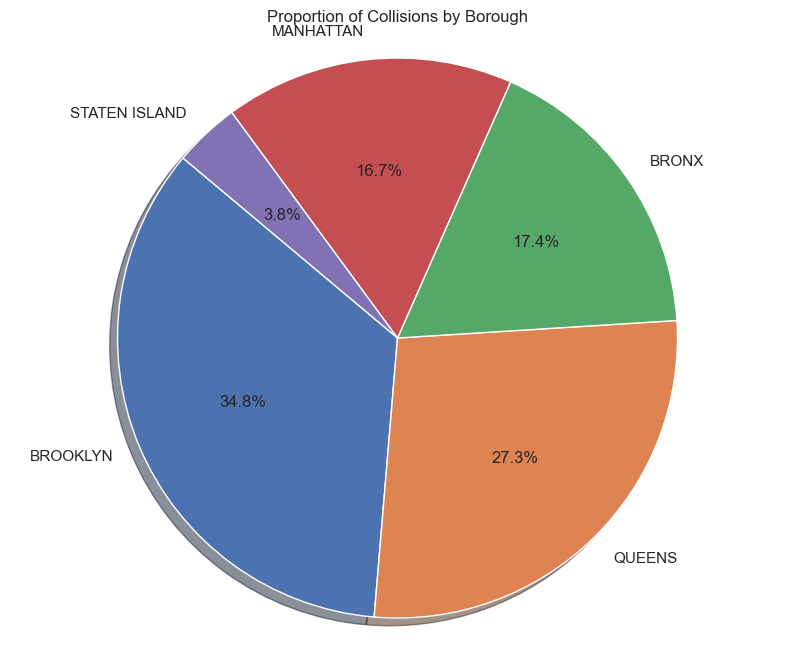
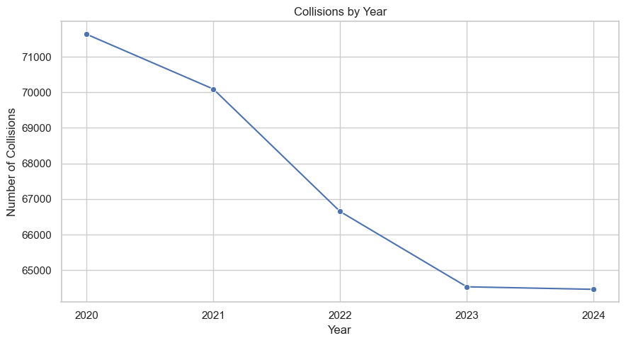
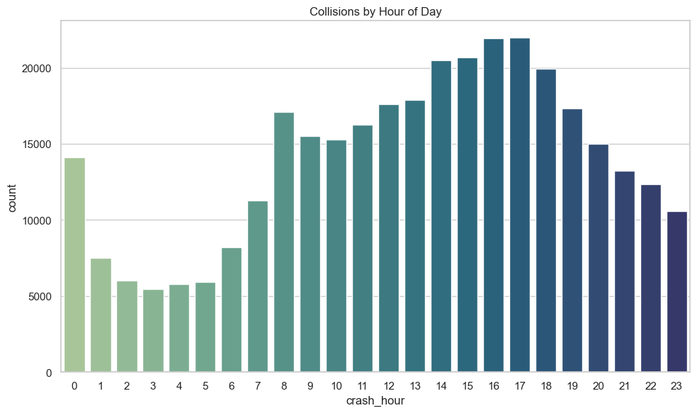
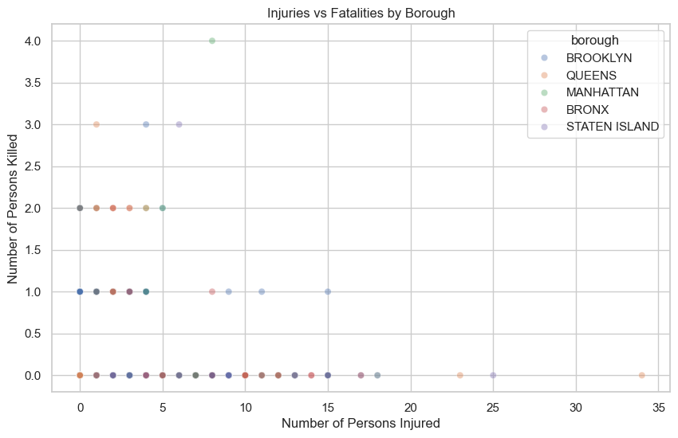
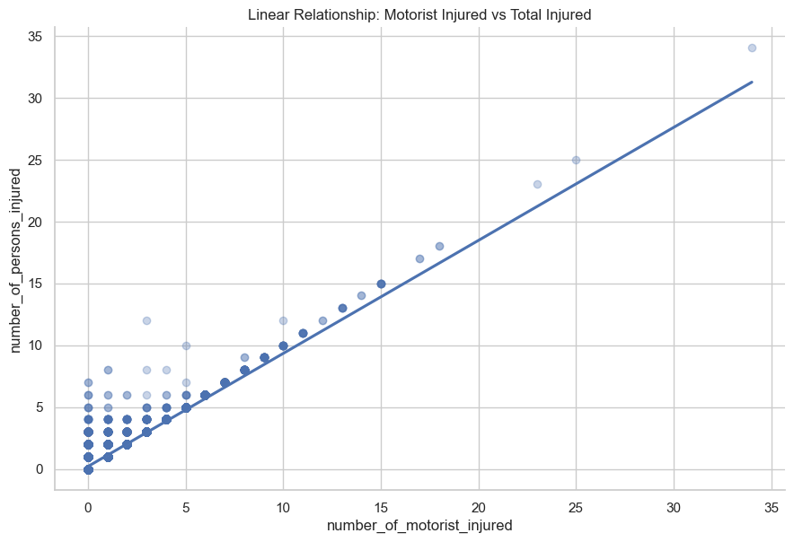
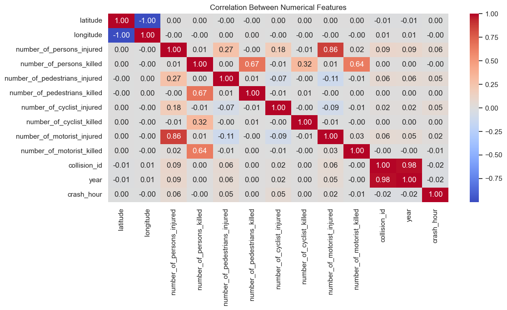
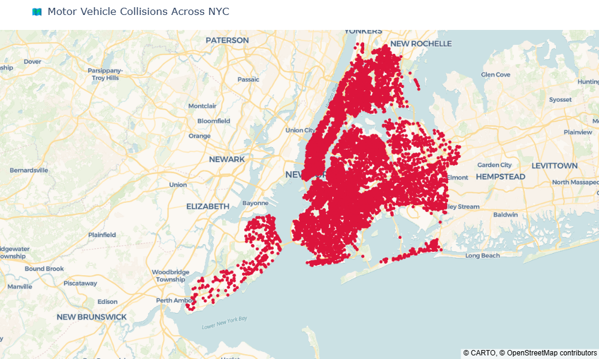

# 🚦 NYC Collision Analysis & Predictions – Streamlit Dashboard

[](https://nyc-collision-analysis-predictions.streamlit.app/)

> An interactive Streamlit dashboard for analyzing NYC motor vehicle collisions using EDA, geospatial maps, and ML predictions.

---
## 🔗 Live App

Access the full dashboard here 👉 [**Streamlit App**](https://nyc-collision-analysis-predictions.streamlit.app/)

It includes:
- 📊 Temporal & Categorical EDA  
- 🧠 Crash Severity & Factor Analysis  
- 🗺️ Geospatial Mapping  
- 🤖 Real-time Predictions using ML models  

---
## 📘 Project Summary

This project offers a full-spectrum analytical tool for understanding and predicting NYC vehicle collisions. Built with **Streamlit**, it leverages **NYPD Open Data** to perform in-depth **EDA**, **interactive mapping**, and **injury/fatality predictions** through trained machine learning models.

---
## 🎯 Key Objectives

The primary goals of this project were:

- 🔍 Perform detailed **EDA** to uncover patterns in NYC vehicle collisions  
- 🗂️ Engineer meaningful features like crash hour, weekday, borough, etc.  
- 🧠 Train **machine learning models** to predict injury count, injury occurrence, and fatality risk  
- 🗺️ Develop an **interactive geospatial map** of crashes for spatial analysis  
- 💻 Deliver a fully functional **Streamlit dashboard** accessible to users without coding knowledge  
- 📈 Support decision-making for urban planning, traffic policy, and public safety

---
## 🗃️ Data Source

Data is sourced from NYC Open Data Portal:

- **[Motor Vehicle Collisions – Crashes (NYPD)](https://data.cityofnewyork.us/Public-Safety/Motor-Vehicle-Collisions-Crashes/h9gi-nx95)**
- Covers: crash date, location, injuries, fatalities, vehicle types, contributing factors

---

<details open>
<summary>📁 <strong>Project Folder Structure</strong> (Click to expand)</summary>

```bash
NYC-Collision-Analysis-Predictions/
├── data/                               # 📦 All dataset files
│   ├── raw_data/                       # 📄 Raw CSVs from NYC Open Data portal
│   │   └── nyc_collisions_2024_to_2020.csv
│   └── cleaned_data/                   # 🧹 Preprocessed datasets for modeling
│       └── nyc_collisions_cleaned.csv
│
├── models/                             # 🧠 Saved ML models
│   ├── gbr_injury_count.pkl            # Regression model for injury count
│   ├── classifier_is_injury.pkl        # Classifier for injury occurrence
│   └── classifier_is_fatal.pkl         # Classifier for fatality prediction
│
├── reports/                            # 📊 Static assets and exportable visuals
│   └── images/                         # PNG charts used in dashboard & README
│       ├── image1.png
│       ├── image2.png
│       └── ...
│
├── notebooks/                          # 📓 EDA, visualizations, and model training
│   ├── EDA_analysis_visualizations.ipynb
│   ├── fatality_classification.ipynb
│   └── other_notebooks.ipynb
│
├── streamlit_app.py                    # 🚀 Main Streamlit app for interactive UI
├── requirements.txt                    # 📋 List of Python packages required
└── README.md                           # 📘 Project overview and documentation
```
</details> 

---
## 🧩 Key Functionalities

### ✅ Exploratory Data Analysis (EDA)
- Borough, year, hour, weekday-based crash distributions  
- Visuals: bar plots, histograms, pie charts, heatmaps  
- Identification of high-risk periods and areas  

### ✅ Crash Severity & Contributing Factors
- Pie charts, scatter plots, injury-fatality analysis  
- Contributing factors breakdown and ranking  
- Heatmap for correlation between key variables  

### ✅ 🗺️ Geospatial Mapping
- Interactive NYC map with filterable collision points  
- Zoom and borough-level filtering  
- Map generated using Plotly with up to 50,000 points for performance  

### ✅ 🔮 Predictive Modeling
- Predict number of injuries (regression)  
- Predict whether injury or fatality will occur (classification)  
- Built using **Scikit-learn** models with encoded inputs  
- Predictions include input sliders/dropdowns and live results  

---
## 📊 Visualizations

<table>
  <tr>
    <td><strong>📍 Proportion of collisions by Borough</strong><br></td>
    <td><strong>📅 Yearly Crash Trend</strong><br></td>
  </tr>
  <tr>
    <td><strong>⏰ Hourly Distribution</strong><br></td>
    <td><strong>🚘 Vehicle Types Involved</strong><br></td>
  </tr>
  <tr>
    <td><strong>🟣Injuries vs Fatalities by Borough</strong><br></td>
    <td><strong>📈 Motorist Injured vs Total Injured</strong><br></td>
  </tr>
  <tr>
    <td><strong>🧮 Correlation Heatmap</strong><br></td>
    <td><strong>🗺️ Geospatial Collision Map</strong><br></td>
  </tr>
</table>

---
## 🧠 ML Prediction Models

Three machine learning models were trained to assist with predictive insights:

| Model Type      | Goal                                | Algorithm           |
|-----------------|--------------------------------------|---------------------|
| Regression      | Predict injury count                 | GradientBoostingRegressor |
| Classification  | Predict whether an injury occurred  | RandomForestClassifier |
| Classification  | Predict whether a fatality occurred | RandomForestClassifier |

All models were trained on encoded features like borough, crash hour, vehicle type, etc., and exported using `joblib`.

---
## ⚙️ Tech Stack

- Python, Pandas, NumPy – data handling

- Matplotlib, Seaborn, Plotly – visualizations

- Scikit-learn, joblib – ML modeling

- Streamlit – interactive dashboard

---
## 🛠️ How to Run the Project Locally
### 1️⃣ Clone this repository
git clone https://github.com/srikanthreddy-29/NYC-Collision-Analysis-Predictions.git
cd NYC-Collision-Analysis-Predictions
### 2️⃣ Create & activate virtual environment
python -m venv venv
source venv/bin/activate  # Windows: venv\Scripts\activate
### 3️⃣ Install dependencies
pip install -r requirements.txt
### 4️⃣ Run the app
streamlit run streamlit_app.py

---
### 📦 Outputs
- Cleaned datasets

- PNG visuals for reporting

- ML models in .pkl format

- Live Streamlit dashboard

---
## 🧾 Conclusion Summary

This project demonstrates the power of combining open data, machine learning, and visual analytics to address real-world urban challenges. By exploring historical NYC crash data, gained actionable insights into when, where, and why vehicle collisions occur.

The end-to-end dashboard serves as a decision-support tool for:
- City planners analyzing spatial crash trends  
- Traffic authorities prioritizing enforcement and road safety  
- Citizens interested in understanding risks in their neighborhoods

Through intuitive design and predictive capabilities, this tool bridges the gap between raw data and impactful action.

---
## 📩 Contact

Interested in collaborating or have questions? Let’s connect!  

🔗 [LinkedIn](https://www.linkedin.com/in/srikanthreddy-maddireddy/)  
💻 [GitHub](https://github.com/srikanthreddy-29)  
🌐 [Live App](https://nyc-collision-analysis-predictions.streamlit.app/)


